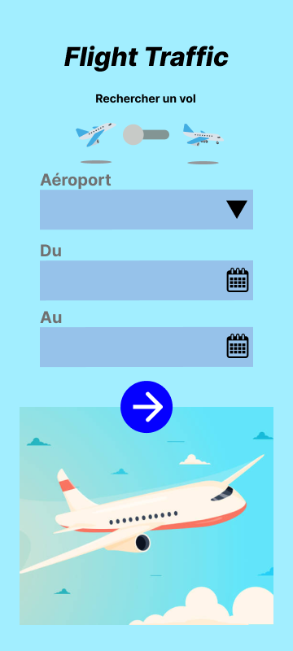
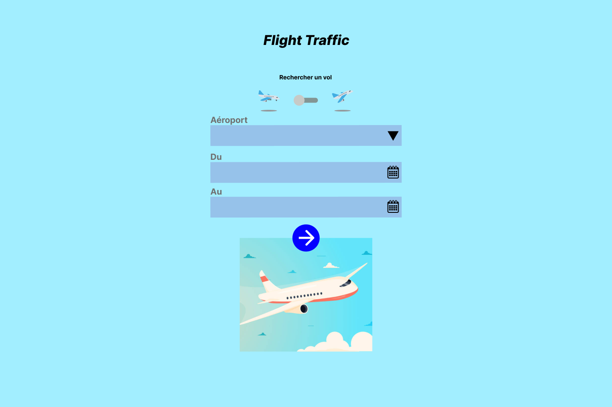
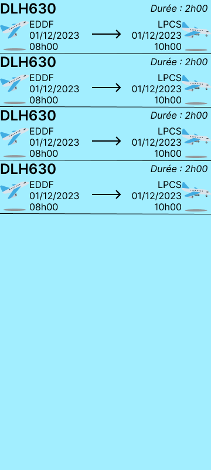
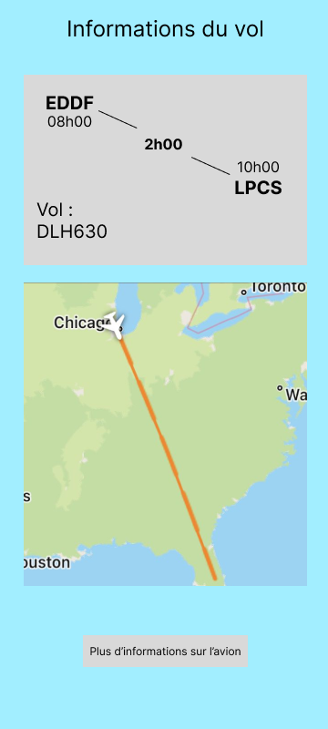
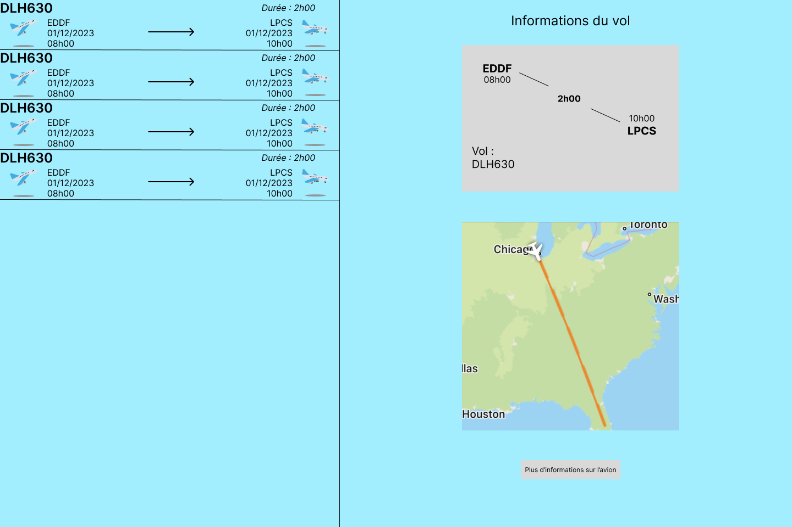

# flights-App
## Maquette
### Écran d'accueil
- Le premier écran contient un formulaire permettant de rechercher des vols selon les critères suivants :
  - Aéroport
  - Départs / Arrivées
  - Intervalle de recherche (entre deux dates séparées de moins d'une semaine)
#### Vue Smartphone

#### Vue Tablette

### Écran de liste des vols
- Après le retour de l'API, la liste des vols est affichée sur cet écran.
  - Le nom de l'avion, la durée du vol, les aéroports et dates de départ et d'arrivée de chaque vol sont affichés.
  - Il suffit de cliquer sur un vol pour obtenir plus d'informations.
#### Vue Smartphone

### Écran d'informations d'un vol
- Cet écran contient les informations supplémentaires du vol sélectionné.
  - Le trajet du vol est visible sur une carte Google Maps.
  - Un bouton "Plus d'informations sur l'avion" permet d'obtenir des informations sur l'état de l'avion.
#### Vue Smartphone

- Sur tablette, les informations du vol sélectionné sont affichées aux côtés de la liste des vols.
#### Vue Tablette

## Évolutions de l'application
- Étant encore peu expérimentés sur le développement d'applications mobiles, il s'agit pour nous d'une découverte des différents aspects de ce type de projet, dont l'utilisation des fragments pour adapter les vues depuis différents écrans. Nous nous sommes concentrés sur la partie fonctionnelle de l'application.
- De nombreuses améliorations sont possibles sur cette application, principalement au niveau de la gestion des erreurs et des fonctionnalités :
  - Le trajet et les détails de l'avion ne sont pas affichés.
  - Le positionnement de certains éléments peut être amélioré.
